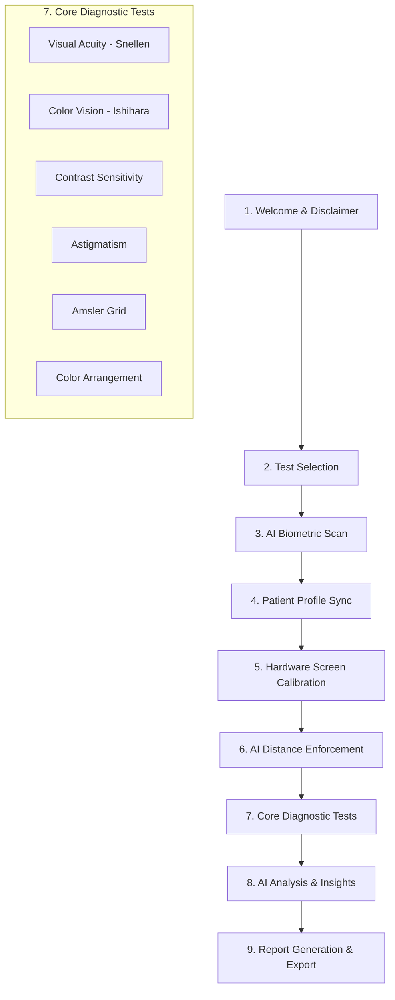

# CoVision System Workflow
**Project:** CoVision: An Edge-AI Cognitive Platform for Standardized Digital Vision Screening
**Author:** Eng. Ahmad Tubaishat

---

## High-Level System Architecture Pipeline

The CoVision platform operates fundamentally as a sequential state-machine, guiding the patient through a rigorous, standardized clinical screening protocol.

---

## Step-by-Step Patient Journey & Technical Execution

### 1. Initialization and Consent (`AppStep.Welcome`)
*   **User Action:** Patient reads the medical disclaimer, acknowledging that CoVision is a screening tool, not a diagnostic replacement.
*   **System Action:** Bootstraps the React application, loads localization assets (English/Arabic), pre-warms the WebAssembly environment, and requests camera permissions.

### 2. Protocol Selection (`AppStep.TestSelection`)
*   **User Action:** Examiner or patient selects the specific tests to administer (e.g., Acuity, Color Vision).
*   **System Action:** Configures the routing pipeline to only include the required diagnostic components, optimizing the testing sequence.

### 3. Edge-AI Biometric Scanning (`AppStep.BiometricScan`)
*   **User Action:** Patient positions themselves within frame.
*   **System Action:** 
    *   Downloads Google MediaPipe `FaceLandmarker` and `PoseLandmarker` models to the local browser context via CDN.
    *   Compiles models to WASM and activates WebGL hardware acceleration.
    *   Initiates real-time 3D landmark extraction (Face + Skeletal + Hands).
    *   Analyzes base biometric data (estimated age, mood, glasses presence) and displays a glowing holographic AR diagnostic overlay.

### 4. Patient Demographics (`AppStep.Profile`)
*   **User Action:** Confirms or corrects the AI-extracted demographic data and inputs their Clinical Name/ID.
*   **System Action:** Synchronizes data into the global application state for report compilation.

### 5. Hardware Optical Calibration (`AppStep.ScreenCalibration`)
*   **User Action:** Patient holds a standard ISO magnetic stripe card (e.g., a credit card) against the screen and adjusts an on-screen bounding box to match its physical dimensions exactly.
*   **System Action:** Calculates the precise Pixels-Per-Millimeter (PPM) ratio of the display. This ensures that a 10mm object rendered on the screen is physically 10mm in the real world, regardless of display resolution or pixel density.

### 6. Spatial Distance Enforcement (`AppStep.Calibration` & `AppStep.CoverEye`)
*   **User Action:** Patient steps exactly 2.0 meters back from the camera and covers their non-testing eye.
*   **System Action:** 
    *   Engages the `useFaceDistance` hook. 
    *   Measures biological facial width in pixels against the calibrated PPM.
    *   Calculates absolute distance using strict trigonometry.
    *   Employs an Exponential Moving Average (EMA) to smooth camera micro-jitters.
    *   Locks the testing interface if the patient moves out of the strict 1.85m - 2.15m testing corridor.

### 7. Clinical Diagnostic Evaluations (`AppStep.Testing`)

#### 7a. Visual Acuity (Tumbling 'E')
*   **Algorithm:** Renders the "E" optotype based on the exact visual angle (5 arcminutes) calculated from the validated 2.0-meter tracking distance.
*   **Logic:** Executes a randomized test loop. Measures the millisecond response time from optotype display to user input. Progressively scales difficulty across LogMAR lines (e.g., 20/40, 20/30, 20/20).
*   **Enforcement:** Continuously runs the AI FaceLandmarker in the background. Aborts the trial and flags non-compliance if the patient leans closer than acceptable tolerance.

#### 7b. Color Vision Deficiency (Ishihara)
*   **Algorithm:** Pre-authenticates lighting conditions. Sequentially displays standardized, high-chromatic-fidelity Ishihara Vectors.
*   **Logic:** Compares patient inputs against known deficiency maps (Protanomaly, Deuteranomaly, Tritanomaly) to dynamically classify their condition.

### 8. Data Aggregation & AI Insights
*   **System Action:** 
    *   Compiles test scores, average response times (in ms), and clinical compliance logs (how often they broke the distance barrier).
    *   Injects raw data into the generative AI reasoning engine (e.g., Gemini Flash 2.0).
    *   Generates a professional, easy-to-read clinical summary classifying the patient into risk strata (Normal, Monitor, Re-Evaluate, Refer to Specialist).

### 9. Report Generation (`AppStep.Report` & `AppStep.Results`)
*   **User Action:** Patient reads results and optionally exports the data.
*   **System Action:** Prepares a standardized digital document (PDF) displaying the Snellen notation, LogMAR scores, Color Vision diagnosis, and the unique AI Medical Insight summary. Includes timestamps and device calibration checksums to verify diagnostic integrity.

---
*Workflow generated directly from execution architecture.*
